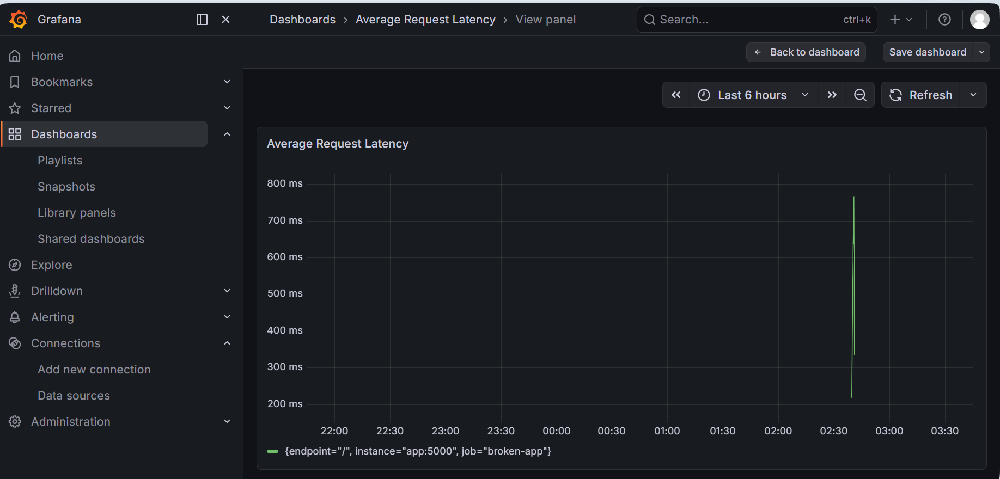
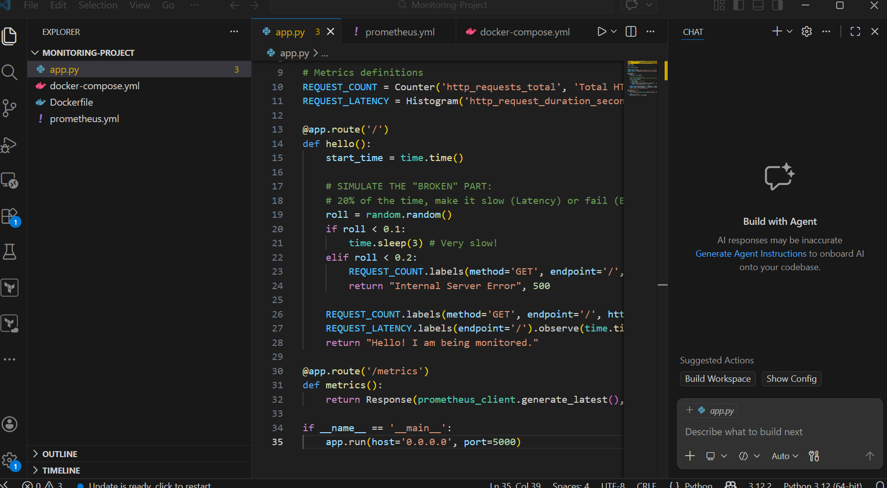
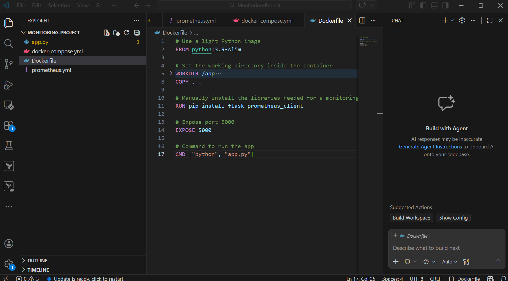
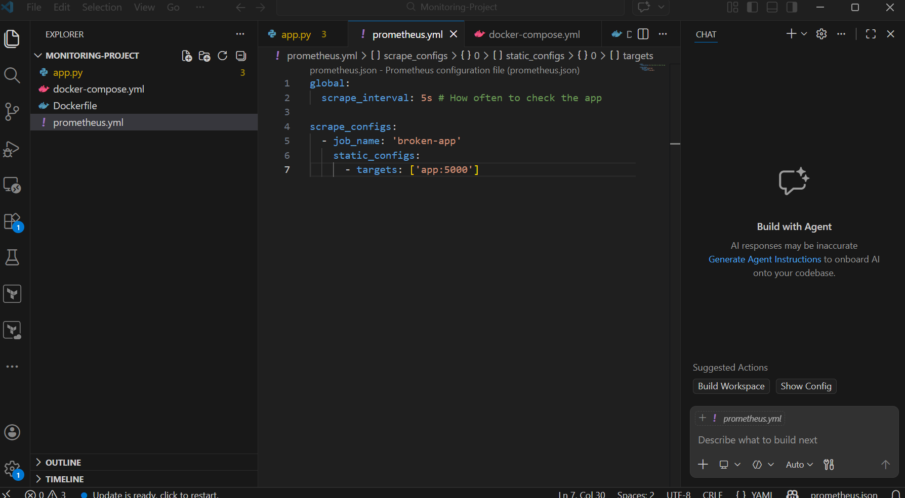
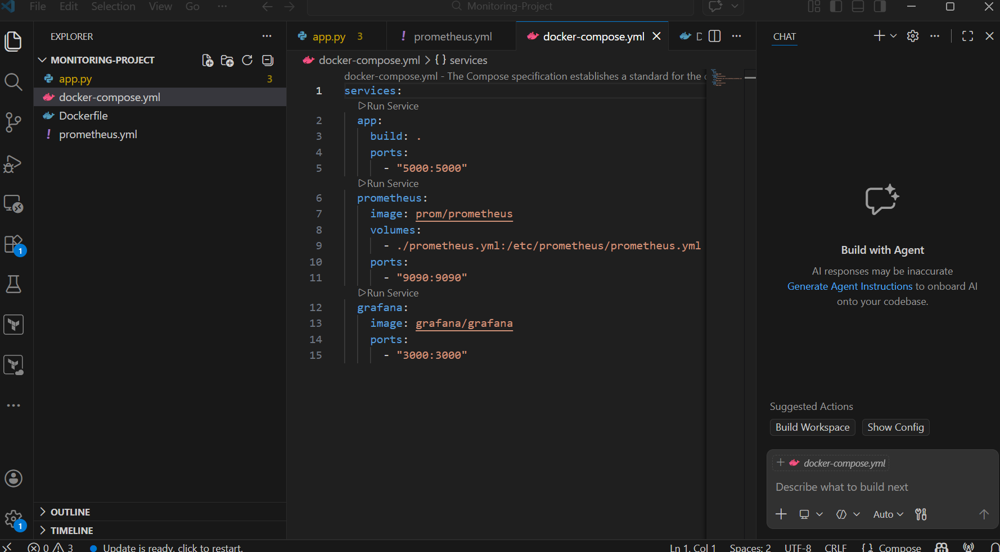
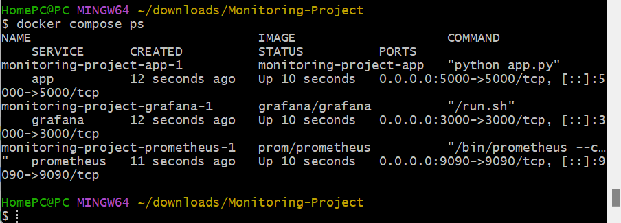
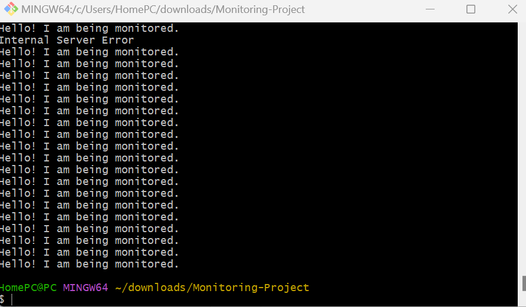

# 📈 Real-Time Monitoring Project (Prometheus & Grafana)

This project demonstrates a full-stack observability solution for a Python application. It uses a **Prometheus** time-series database to scrape metrics from a **Flask** app and visualizes them through a **Grafana** dashboard.

## 🚀 Key Features
- **Custom Metrics:** The app exposes real-time data on request duration and error rates using the Prometheus Python client.
- **Dockerized Infrastructure:** The entire stack (App, Prometheus, Grafana) is orchestrated using Docker Compose.
- **Visual Dashboards:** Includes a Grafana dashboard showing the "Golden Signals" of Latency and Errors.

## 🛠 Tools Used
- **Backend:** Python (Flask)
- **Monitoring:** Prometheus
- **Visualization:** Grafana
- **Infrastructure:** Docker & Docker Compose

## ⚙️ Setup Instructions
Once the services are launched, you can access the different components of the stack using the links below:

- **🚀 Application:** [http://localhost:5000](http://localhost:5000)
- **🔥 Prometheus:** [http://localhost:9090](http://localhost:9090)
- **📊 Grafana:** [http://localhost:3000](http://localhost:3000) (Login: **admin** / **admin**)

> [!NOTE]
> The links above point to `localhost`. They will only work when the project is actively running on your local machine via Docker.

---

## 📊 Visualizations

### Request Latency Monitoring
To track performance, I implemented a custom **PromQL** query to visualize the **"Golden Signal"** of Latency. This query calculates the average request duration by dividing the total time by the request count:

```promql
rate(http_request_duration_seconds_sum[1m]) / rate(http_request_duration_seconds_count[1m])

🛠 Technical Workflow Gallery
Below are the technical components and verification steps passed during the development of this monitoring stack.
1. Application & Containerization
The Flask app was instrumented with the Prometheus client and packaged into a lightweight Docker image.
<p align="center">


</p>
2. Infrastructure & Scrape Config
Prometheus was configured to scrape the app every 5 seconds. Docker Compose handles the networking between services.
<p align="center">


</p>
3. Verification & Traffic Generation
I generated simulated traffic to verify the detection of 500 Internal Server Errors and Latency Spikes.
<p align="center">


</p>

---

## 🛡️ DevSecOps Note

> [!IMPORTANT]
> As part of this workflow, I integrated security best practices by ensuring that only images with a successful exit code are pushed to the registry, effectively **"shifting left"** in the development lifecycle.

---

## 📬 Connect with Me

- **Name:** Melvin Okwara
- **LinkedIn:** [linkedin.com/in/melvin-okwara-3a8b81330](https://linkedin.com/in/melvin-okwara-3a8b81330)
- **Email:** [okwaramelvin11@gmail.com](mailto:okwaramelvin11@gmail.com)
- **Portfolio:** [github.com/MelvinOkwara](https://github.com/MelvinOkwara)
